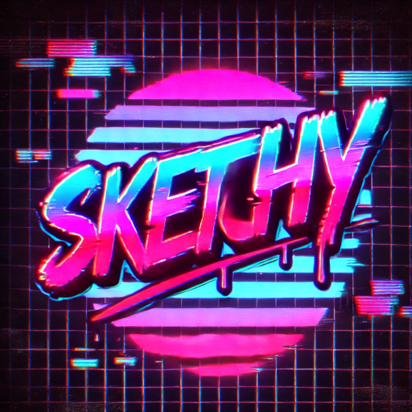
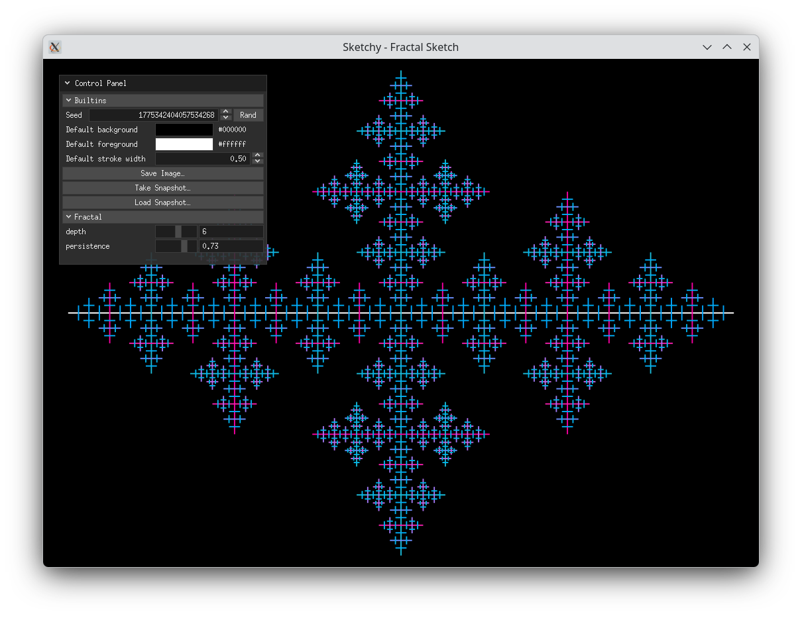
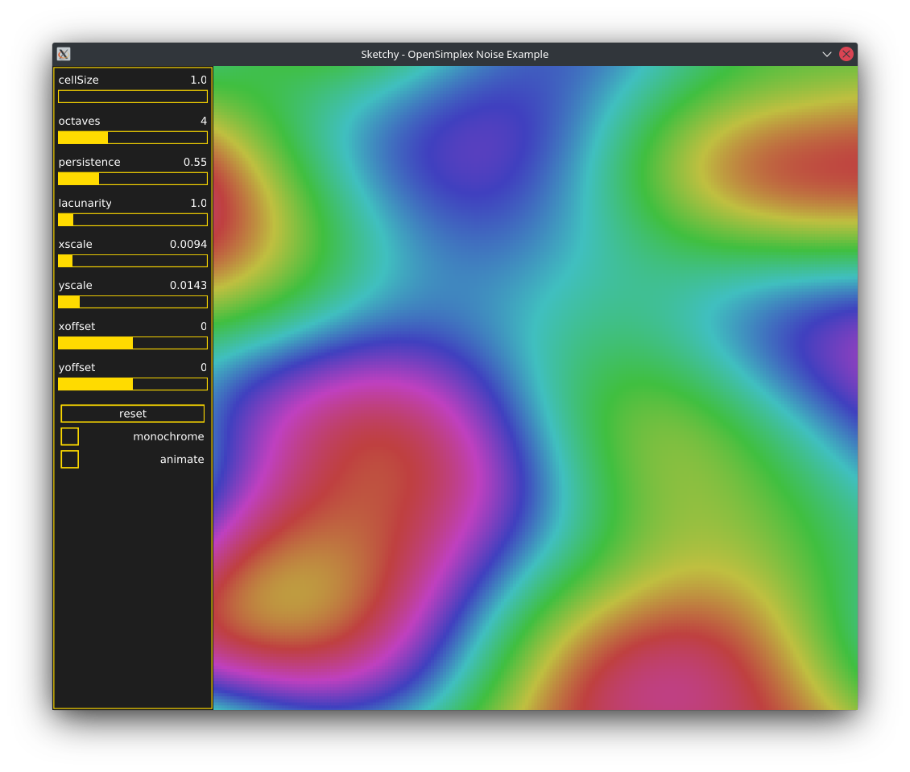
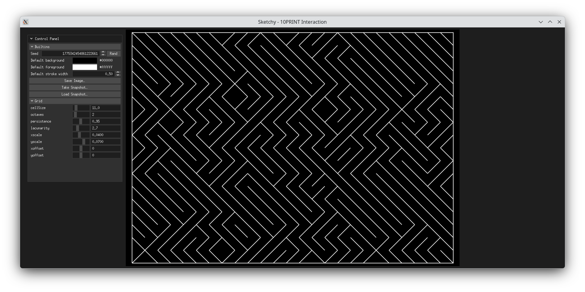

Sketchy is a framework for making generative art in Go. It is inspired by [vsketch](https://github.com/abey79/vsketch) and [openFrameworks](https://github.com/openframeworks/openFrameworks). It uses [canvas](https://github.com/tdewolff/canvas) for drawing and the [ebiten](https://github.com/hajimehoshi/ebiten) game engine for the GUI. It's designed to provide controls (sliders) via simple JSON that can be used within a familiar `update()` and `draw()` framework to enable quick iteration on designs.

The [Getting Started](docs/getting-started.md) guide is a good place to start, and even walk through creating a "Hello Circle" sketch from scratch.

Below are a couple of screenshots from the example sketches:

### Fractal

### Noise



### 10PRINT


# Installation

## Prerequisites
Sketchy requires Go version 1.17 or higher. It assumes that `go` is in the system path. If you are running Windows, install Windows Subsystem for Linux (WSL), so that you have `bash`, which is used by the install script.

## Clone the repo

```shell
git clone https://github.com/aldernero/sketchy.git
```
## Install sketchy environment
```shell
cd sketchy/scripts
./sketch_install.sh <target_directory>
```
This will create a directory `target_directory`, build the sketchy binary, and copy the binary and template files to the newly created directory.

Example:

```bash
❯ cd ~/sketchy/scripts
❯ ./sketchy_install.sh ~/sketchy_files
Sucessfully installed sketchy environment to /home/vernon/sketchy_files
❯ tree ~/sketchy_files
/home/vernon/sketchy_files
├── sketchy
└── template
    ├── main.go
    └── sketch.json

1 directory, 3 files
```
Sketchy is now installed and ready to run from `target_directory`.

## Running the examples
For any of the examples in the `examples` directory, run using standard go commands:
```shell
❯ cd ~/sketchy/examples/lissajous
❯ go run main.go
```

# Creating a new sketch

The syntax for creating a new sketch is `sketchy init project_name`. This will create a new directory with a configuration file and base sketch file:
```shell
❯ ./sketchy init mysketch
❯ tree mysketch
mysketch
├── go.mod
├── go.sum
├── icon.png
├── main.go
└── sketch.json
```
Sketchy init's a go module and runs `go mod tidy` to get all of the go dependencies.

The next step are to configure sketch parameter and controls in `sketch.json` and add the drawing code to `main.go`. See the `examples` directory and documentation for more details.

# Running a sketch

The syntax for running a sketch is `sketchy run project_name`. This is just a wrapper around running `go run main.go` from the project directory. Even the empty example above will run, althought you'll just see the 2 example controls and a blank drawing area.

# Saving sketches and configurations

There are three builtin keyboard shortcuts for saving sketch images and configurations:
- "s" key - saves the current frame as an SVG file. The filename has the format `<prefix>_<timestamp>.svg`, where `<prefix>` by default is the project name (what you used during `sketchy init project_name`)
- "p" key - same as above but saves the current frame as a PNG image.
- "c" key - saves the configuration (control values and sketch parameters) as JSON. The filename has the format `<prefix>_config_<timestamp>.json`, where `<prefix>` by default is the project name (what you used during `sketchy init project_name`)
- "Esc" key - saves a screenshot whole window, including the control panel. The filename has the format `screenshot_<timestamp>.png`
