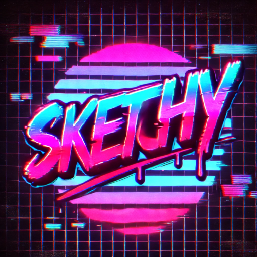
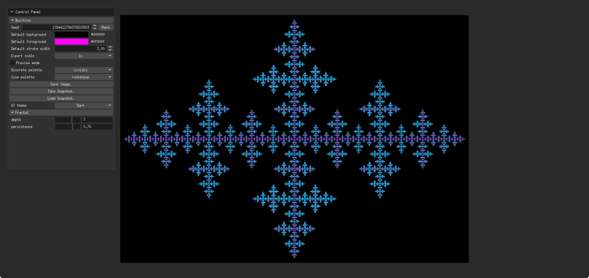
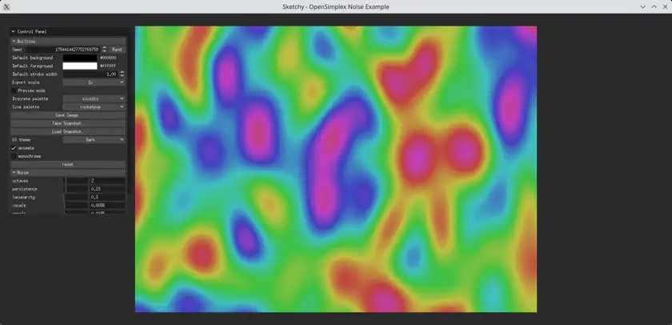
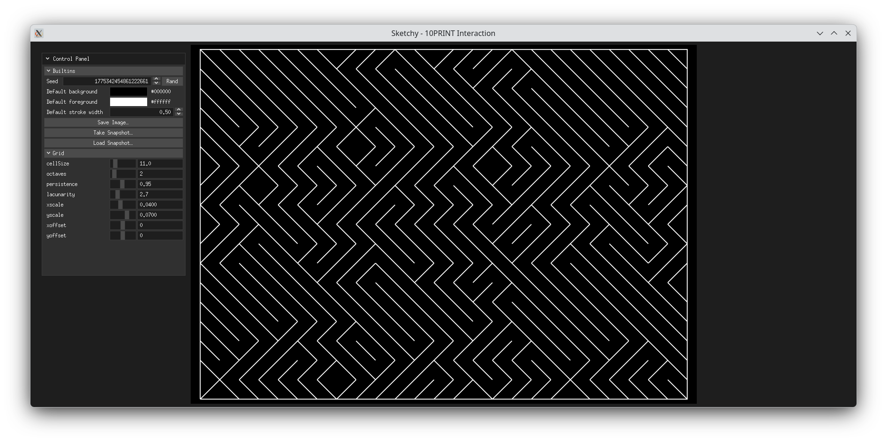
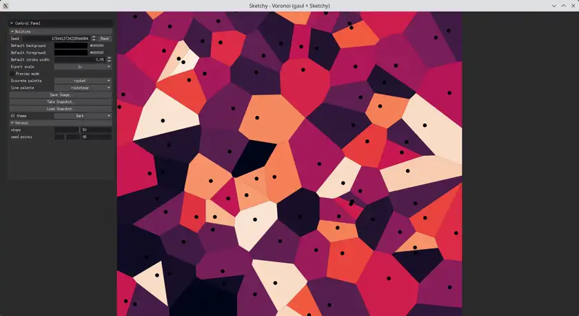
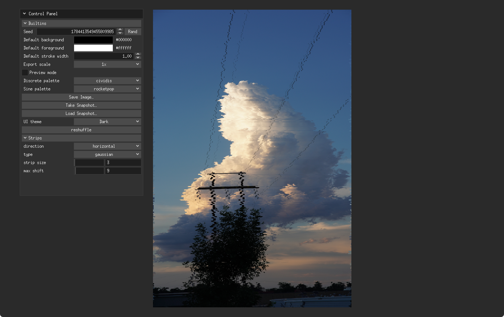
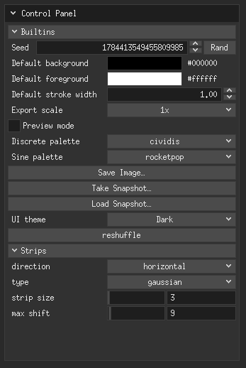

Sketchy is a framework for making generative art in Go. It is inspired by [vsketch](https://github.com/abey79/vsketch) and [openFrameworks](https://github.com/openframeworks/openFrameworks). It uses [gaul](https://github.com/aldernero/gaul) for drawing and the [ebiten](https://github.com/hajimehoshi/ebiten) game engine for the GUI.

Sketches are **code-first**: you construct a [`sketchy.Config`](config.go), call [`sketchy.New`](sketch.go), assign [`BuildUI`](sketch.go) to register controls with [`UI`](ui_builder.go) helpers (`FloatSlider`, `IntSlider`, `Checkbox`, `ColorPicker`, `Dropdown`, `Folder`, etc.), then implement [`Updater`](sketch.go) and [`Drawer`](sketch.go). Control values are read with [`GetFloat`](sketch.go) / [`GetInt`](sketch.go) / [`Toggle`](sketch.go) using folder and name (use `""` for the root folder). There is **no** `sketch.json` for controls or layout.

Your `Drawer` receives a [`*render.Context`](https://pkg.go.dev/github.com/aldernero/gaul/render) from gaul's render package. **Coordinates are pixels** — origin at the top-left, x right, y down — and the canvas is exactly `SketchWidth` × `SketchHeight`. The context supports both Processing-style immediate drawing (`Push`/`Pop`, `Translate`/`Rotate`/`Scale`, `MoveTo`/`LineTo`, `Fill`/`Stroke`) and gaul's primitive-first style (`gaul.Circle{...}.Draw(ctx)`). Every frame is also recorded, so PNG saves (at any export scale) and plotter-friendly SVG saves reproduce exactly the frame on screen. Animations can be [recorded to video](docs/recording.md) (WebM/VP9, MP4, animated WebP, or lossless FFV1) via ffmpeg — including armed perfect-loop captures that start and stop on tick moduli.

Sketchy also supports GPU [**shader sketches**](docs/shaders.md) (`sketchy init shader <name>`): the sketch is a [Kage](https://ebitengine.org/en/documents/shader.html) fragment shader whose `//sketchy:` directive comments auto-generate the control panel — each uniform's slider/color/checkbox/dropdown is declared next to the uniform itself, the file live-reloads while the sketch runs, and PNG export and video recording work via GPU readback.

The [Getting Started](docs/getting-started.md) guide walks through install, `sketchy init`, and a small “Hello Circle” sketch using the code-first API; the [`examples/`](examples/) directory has full programs you can copy from.

Below are a couple of screenshots/videos from the example sketches:

### Fractal

### Noise



### 10PRINT


### Voronoi



### Photo Shift


# Installation

Sketchy tracks a recent Go toolchain (see [`go.mod`](go.mod) for the exact minimum). Install the **`sketchy`** CLI with:

```shell
go install github.com/aldernero/sketchy/cmd/sketchy@latest
```

Ensure `$(go env GOPATH)/bin` (or your `GOBIN` directory) is on your `PATH` so the `sketchy` command is found.

## Running the examples

From any directory, run a tagged example package with `go run` (no separate clone required):

```shell
go run github.com/aldernero/sketchy/examples/lissajous@latest
```

Swap `lissajous` for another folder name under [`examples/`](examples/).

# Creating a new sketch

The CLI syntax is `sketchy init <sketch|shader> project_name` — `sketch` for a CPU-canvas sketch, `shader` for a [Kage shader sketch](docs/shaders.md). It creates a new directory, copies the embedded template, and runs `go mod init` and `go mod tidy`:

```shell
❯ sketchy init sketch mysketch
❯ tree mysketch
mysketch
├── go.mod
├── go.sum
├── main.go
└── .gitignore
```

(A shader project additionally contains `fragment.kage`.)

Edit `main.go`: set fields on [`sketchy.Config`](config.go) (title, size, colors, [`DefaultBackground`](config.go) / [`DefaultForeground`](config.go) / [`DefaultStrokeWidth`](config.go), …), register controls in `BuildUI`, then call [`Init`](sketch.go). The template loads `icon.png` if present for the window icon.

# Running a sketch

`sketchy run project_name` changes into that directory and runs `go run .` (expects a `main.go`).

# The control panel

The control panel is built with [debugui](https://github.com/aldernero/debugui), an Ebitengine-oriented UI toolkit; see that repository for API details and licensing.



## User-defined controls

- **Folders** — `ui.Folder("Title", func() { … })` groups controls under a collapsible header.
- **Float sliders** — Track plus a **text field** for the value (similar to lil-gui). Values are validated as floats; scientific notation such as `1e-12` is accepted. Use [`FloatSliderDecimals`](ui_builder.go) when you want a fixed number of digits after the decimal in the text box; plain [`FloatSlider`](ui_builder.go) derives display precision from the step. **Secondary-click** (e.g. right-click) on the slider or value opens a range/step editor modal.
- **Int sliders** — Same pattern with integer-only text validation and stepping.
- **Checkboxes, buttons, color pickers, dropdowns** — See [`ui_builder.go`](ui_builder.go).

## Builtins

The **Builtins** header is fixed by Sketchy (not part of your `uiPlan`):

- **Seed** — Integer seed and **Rand** button; mirrors [`RandomSeed`](sketch.go).
- **Default background** / **Default foreground** — Color pickers; define the canvas clear color and the initial stroke color before your [`Drawer`](sketch.go) runs. The margin around the letterboxed sketch uses a **dark grey** (Dark theme) or **light grey** (Light theme) so the drawable area reads clearly against the window border.
- **Default stroke width** — Pixels, text field with clamped range.
- **Export scale** — Preset multiplier (1×–8×) for raster resolution. The sketch always displays at `SketchWidth` × `SketchHeight`, but redraws rasterize at the scaled size and PNG saves gain the full detail (e.g. a 2048px sketch at 4× saves an 8192px PNG). Persisted in snapshots. At high scales, redraws get slow — that's what the next control is for.
- **Preview mode** — Renders the display at half resolution (~4× faster redraws) while iterating; saves are unaffected and still use the export scale. Not persisted in snapshots.
- **Discrete palette** / **Sine palette** — Dropdowns listing [palettedb](https://github.com/aldernero/palettedb) palettes: those stored in a palettedb database first, then palettedb's built-ins (viridis, plasma, turbo, …), which are always available even without a database. Selecting a name loads it into [`DiscretePalette`](sketch.go) (a `gaul.Gradient`) / [`SinePalette`](sketch.go) (a `gaul.SinePalette`) for use in your `Drawer`, so designs can switch color palettes on the fly. The database is looked up at [`PaletteDBPath`](sketch.go) (set it before `Init`, e.g. from a `-palettedb` CLI flag as in the project template), defaulting to `~/.config/palettedb/palettedb.db`.
- **Save Image…** / **Take Snapshot…** / **Load Snapshot…** — Dialogs for PNG/SVG export and SQLite-backed snapshots (see below).

The panel is hidden from rasterized sketch output. Close or reopen it with **Ctrl+Space** (plain **Space** is reserved for typing in text fields).

# Saving images and snapshots

- **Save Image…** — Writes under `saves/png/` and/or `saves/svg/` relative to the process working directory (usually your sketch project). Saves replay the recorded frame, so the file matches the display exactly: PNG renders at the Builtins **Export scale**, and SVG is true vector output (real stroked bezier paths, ready for pen plotting). Saves can be recorded in **`sketch.db`**.
- **Snapshots** — Stored in **`sketch.db`** with:
  - **`control_json`** — Sliders, int sliders, toggles, user color pickers, dropdowns.
  - **`builtin_json`** — Default background/foreground (hex), default stroke width (px), random seed, export scale, and selected discrete/sine palette names so builtins round-trip with the rest of the controls.

First run creates or migrates the database.

There are **no** default single-key bindings for “save PNG/SVG/config JSON” in the current codebase; use the Builtins dialogs (and **Esc** for Ebitengine’s screenshot key if you set `EBITEN_SCREENSHOT_KEY` in [`Init`](sketch.go)).

# Keyboard shortcuts (control panel / seed)

| Key | Action |
|-----|--------|
| **↑** / **↓** | Increment / decrement random seed |
| **/** | Randomize seed |
| **Ctrl+Space** | Show / hide control panel |

# Window and viewport

The sketch view can be **resized**; content is letterboxed/panned when the window aspect differs from the sketch. [`WindowSize`](sketch.go) reflects the outer window size used by Ebitengine.
