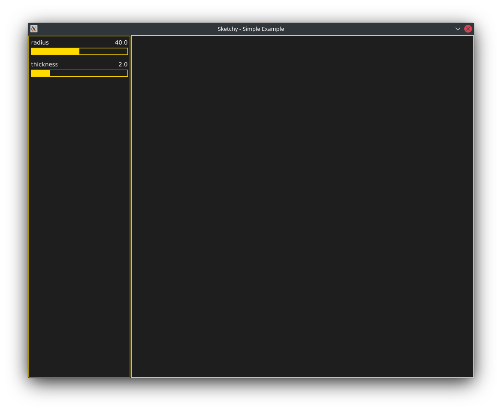
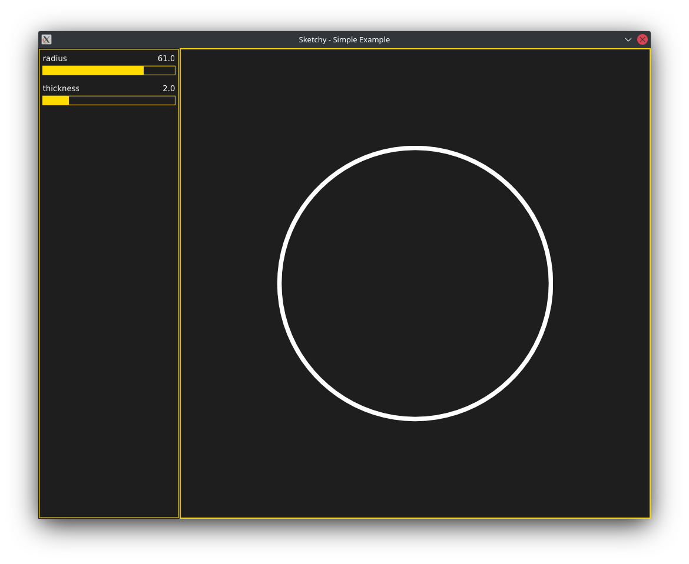

This guide covers installation of sketchy and creating your first sketch.

# Installation

## Prerequisites
Sketchy requires Go version 1.17 or higher. It assumes that `go` is in the system path. If you are running Windows, install Windows Subsystem for Linux (WSL), so that you have `bash`, which is used by the install script.

## Clone the repo

```shell
git clone https://github.com/aldernero/sketchy.git
```
## Install sketchy environment
```shell
cd sketchy/scripts
./sketch_install.sh <target_directory>
```
This will create a directory `target_directory`, build the sketchy binary, and copy the binary and template files to the newly created directory.

Example:

```bash
❯ cd ~/sketchy/scripts
❯ ./sketchy_install.sh ~/sketchy_files
Sucessfully installed sketchy environment to /home/vernon/sketchy_files
❯ tree ~/sketchy_files
/home/vernon/sketchy_files
├── sketchy
└── template
    ├── main.go
    └── sketch.json

1 directory, 3 files
```
Sketchy is now installed and ready to run from `target_directory`.

## Running the examples
For any of the examples in the `examples` directory, run using standard go commands:
```shell
❯ cd ~/sketchy/examples/lissajous
❯ go run main.go
```

# Creating a new sketch

The syntax for creating a new sketch is `sketchy init project_name`. This will create a new directory with a configuration file and base sketch file:
```shell
❯ ./sketchy init mysketch
❯ tree mysketch
mysketch
├── go.mod
├── go.sum
├── main.go
└── sketch.json
```
Sketchy init's a go module and runs `go mod tidy` to get all of the go dependencies.

The next step are to configure sketch parameter and controls in `sketch.json` and add the drawing code to `main.go`. See the `examples` directory and documentation for more details.

# Example: creating a "Hello Circle" sketch
Rather than a typical "Hello World!" program, let's create something graphical that illustrates how to use controls and draw in the sketch area.

Create a new sketch called `hello_circle`
```shell
❯ ./sketchy init hello_circle
❯ cd hello_circle
❯ ls
go.mod  go.sum  main.go  sketch.json
```
So far this is identical to the previous section. Let's look at the contents of `sketch.json`:
```json
{
    "SketchWidth": 800,
    "SketchHeight": 800,
    "ControlWidth": 240,
    "Sliders": [
        {
            "Name": "control1",
            "MinVal": 1,
            "MaxVal": 100,
            "Val": 10,
            "Incr": 1
        },
        {
            "Name": "control2",
            "MinVal": 0,
            "MaxVal": 2,
            "Val": 0.9,
            "Incr": 0.01
        }
    ]
}
```
This is the default configuration with 2 example controls. The first 3 lines define the sketch area size (800 x 800 pixels), and the the control area width (240 pixels). The "Controls" section lists the controls that will appear as sliders in the sketch. Let's make them more meaningful. The first one will represent the radius of a circle we draw in the sketch area. The second one will represent the line width of the circle. Change the values to the following:
```json
{
    "SketchWidth": 800,
    "SketchHeight": 800,
    "ControlWidth": 240,
    "Sliders": [
        {
            "Name": "radius",
            "MinVal": 0,
            "MaxVal": 80,
            "Val": 40,
            "Incr": 0.5
        },
        {
            "Name": "thickness",
            "MinVal": 0,
            "MaxVal": 10,
            "Val": 2,
            "Incr": 0.1
        }
    ]
}
```
Notice that the radius can vary from 0 to 80 mm and the line thickness can vary from 0 to 10 mm.

Run the sketch to see the controls in action:
You can run `sketchy run hello_circle` from sketchy's base directory, or if you are inside the project directory, you can use go directly:
```shell
go run main.go
```


You should see 2 sliders in the control area on the left. You can change the values by clicking or dragging within the slider bar area. You can also use the mouse wheel to increment and decrement the value. The sketch area is blank at the moment, let's change that!

Close the sketch and open `main.go` in an editor. There are two functions `update` and `draw` where you implement the drawing. For a simple case like this we don't need `update`, we can do everything in the `draw` function.
```go
func update(s *sketchy.Sketch) {
	// Update logic goes here
}

func draw(s *sketchy.Sketch, c *canvas.Context) {
	// Drawing code goes here
}
```
Notice that the `draw` function takes two arguments. The first argument stores the Sketch struct used to store our sketch information, including the two slider controls. Here is how you get the value from a slider:

```go
val := s.Slider("slider name")
```

The value will be a float64. For our case we could define two variables that are tied to the controls we defined earlier:
```go
radius := s.Slider("radius")
thickness := s.Slider("thickness")
```
Notice the argument to `Var` is the same name we used in `sketch.json`.

The other argument to `draw` is a `canvas` drawing context. See the [canvas](https://github.com/tdewolff/canvas) documentation for full details. For this example we will simply 1) set a drawing color, 2) set the line thickness, 3) define the circle object, and 4) draw the circle.  Here is the entire draw function:
```go
func draw(s *sketchy.Sketch, c *canvas.Context) {
	// Drawing code goes here
	radius := s.Slider("radius")
	thickness := s.Slider("thickness")
	c.SetStrokeColor(color.White)
	c.SetStrokeWidth(thickness)
    circle := canvas.Circle(radius)
    c.DrawPath(c.Width()/2, c.Height()/2, circle)
}
```
The `canvas.Circle` creates a circular path with a given radius. The `DrawPath` function draws a path at a given (x, y) position. We can reference the canvas width and height values using the context functions. Halving these values places the circle at the center of the drawing area.

Run the sketch again, and you should see a white circle in the sketch area, and you should be able to vary the radius and thickness with the sliders. 

Congratulations, you made your first sketch!

# Saving sketches and configurations

There are three builtin keyboard shortcuts for saving sketch images and configurations:
- "s" key - saves the current frame as an SVG file. The filename has the format `<prefix>_<timestamp>.svg`, where `<prefix>` by default is the project name (what you used during `sketchy init project_name`)
- "p" key - same as above but saves the current frame as a PNG image.
- "c" key - saves the configuration (control values and sketch parameters) as JSON. The filename has the format `<prefix>_config_<timestamp>.json`, where `<prefix>` by default is the project name (what you used during `sketchy init project_name`)