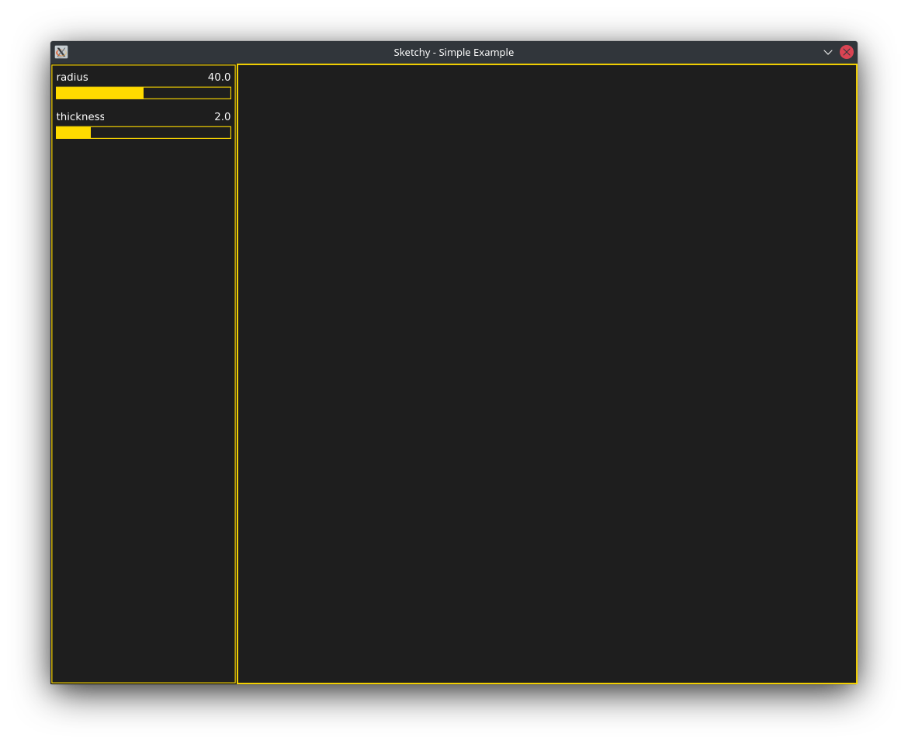
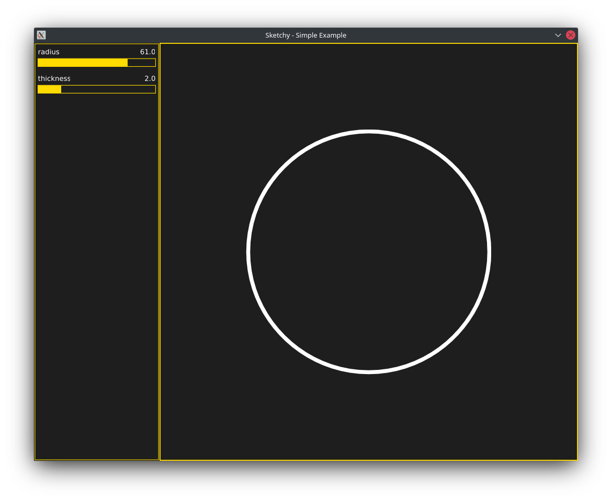

This guide covers installing Sketchy and creating your first sketch. For a concise feature overview (builtins, snapshots, keyboard shortcuts), see the [README](../README.md).

# Installation

## Prerequisites

Sketchy needs a recent Go toolchain (see the root [`go.mod`](../go.mod) for the minimum version). Ensure `go` is on your `PATH`.

On Windows you can use the native Go toolchain; you do not need WSL unless you prefer it.

## Install the `sketchy` CLI

```shell
go install github.com/aldernero/sketchy/cmd/sketchy@latest
```

Put `$(go env GOPATH)/bin` (or your `GOBIN` directory) on your `PATH` so the `sketchy` command is available in any terminal.

## Running the examples

Each program under [`examples/`](../examples/) is a `main` package in the same module. From any directory you can run one with a tagged version:

```shell
go run github.com/aldernero/sketchy/examples/simple@latest
```

Change `simple` to another example folder name as needed.

If you have a [local clone](https://github.com/aldernero/sketchy) of the repository, you can instead:

```shell
cd examples/simple
go run .
```

# How a sketch is structured

A sketch is plain Go code—there is **no** `sketch.json` for controls.

1. Call [`sketchy.New`](../sketch.go) with a [`sketchy.Config`](../config.go) (window title, sketch size, colors, optional defaults for canvas background/foreground/stroke width, etc.).
2. Set [`BuildUI`](../sketch.go) to a function that registers controls with [`sketchy.UI`](../ui_builder.go) (`FloatSlider`, `IntSlider`, `Checkbox`, `ColorPicker`, `Dropdown`, `Folder`, …).
3. Set [`Updater`](../sketch.go) and [`Drawer`](../sketch.go).
4. Call [`Init`](../sketch.go) (opens `sketch.db`, builds the control map, applies defaults).
5. Configure Ebitengine (window size/title from [`WindowSize`](../sketch.go), etc.) and run [`ebiten.RunGame`](../cmd/sketchy/template/main.go).

Control values are read by **folder** and **name**. Use `""` for the root folder. Helpers like [`Slider`](../sketch.go) / [`Int`](../sketch.go) are shorthand for the root folder only.

# Creating a new sketch with the CLI

```shell
sketchy init hello_circle
cd hello_circle
```

Typical layout after `init`:

```text
hello_circle/
├── go.mod
├── go.sum
├── main.go
└── .gitignore
```

`sketchy init` copies the embedded template, runs `go mod init` and `go mod tidy`. The template includes a sample `buildUI`, empty `update`/`draw`, and optional `icon.png` loading if you add that file next to `main.go`.

Run the project from its directory:

```shell
go run .
```

Or from anywhere above it:

```shell
sketchy run hello_circle
```

# Example: “Hello Circle”

We’ll turn the template into a minimal circle demo: two float sliders at the **root** folder (`radius` and `thickness`), an 800×800 sketch, and a `draw` function that reads those values.

## 1. Adjust `buildUI`

Replace the template’s `buildUI` with two sliders (names must match what you pass to `Slider` / `GetFloat`):

```go
func buildUI(_ *sketchy.Sketch, ui *sketchy.UI) {
	ui.FloatSlider("radius", 0, 80, 40, 0.5)
	ui.FloatSlider("thickness", 0, 10, 2, 0.1)
}
```

`FloatSlider` takes `name`, `min`, `max`, `initial`, `step` (all in canvas/mm units as elsewhere in Sketchy). The value column is a **text field** (you can type numbers, including forms like `1e-3`); the track shows position only.

To group controls under a header, wrap them in `ui.Folder("Shape", func() { … })` and then use `s.GetFloat("Shape", "radius")` instead of `s.Slider("radius")`.

## 2. Set sketch size in `Config`

In `main`, pass the size you want (template defaults are larger):

```go
s := sketchy.New(sketchy.Config{
	Title:        "Hello Circle",
	SketchWidth:  800,
	SketchHeight: 800,
})
```

You can also set `ControlOutlineColor`, [`DefaultBackground`](../config.go), and other fields on [`Config`](../config.go). The margin around the sketch follows the Builtins Dark/Light theme (grey), not `SketchBackgroundColor`.

## 3. Implement `draw`

Import `image/color` for explicit stroke color if you like (the framework also sets default stroke from Builtins before `Drawer` runs):

```go
func draw(s *sketchy.Sketch, c *canvas.Context) {
	radius := s.Slider("radius")
	thickness := s.Slider("thickness")
	c.SetStrokeColor(color.White)
	c.SetStrokeWidth(thickness)
	circle := canvas.Circle(radius)
	c.DrawPath(c.Width()/2, c.Height()/2, circle)
}
```

[`Slider`](../sketch.go) is equivalent to [`GetFloat("", "radius")`](../sketch.go). The second argument to `draw` is a [tdewolff/canvas](https://github.com/tdewolff/canvas) context; see that project for paths, transforms, and text.

Leave `update` empty for this example, or use it when you need animation or to react to [`DidControlsChange`](../sketch.go).

Run `go run .` again. You should see the sliders and a centered circle whose radius and stroke you can edit.





A finished version of this idea (with a `Shape` folder) lives in [`examples/simple/main.go`](../examples/simple/main.go).

# Saving images and snapshots

Quick saves are not bound to single-letter keys by default. Use the **Builtins** section of the control panel:

- **Save Image…** — PNG and/or SVG under `saves/png` and `saves/svg` (relative to the process working directory, usually your project).
- **Take Snapshot…** / **Load Snapshot…** — Store and restore control state in **`sketch.db`**, including a **`builtin_json`** payload (default colors, stroke width, seed) alongside **`control_json`**.

See the [README](../README.md) for keyboard shortcuts (seed nudge, panel visibility) and other builtins.
